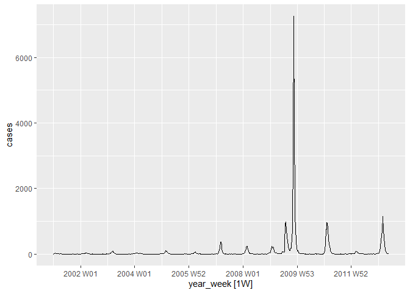
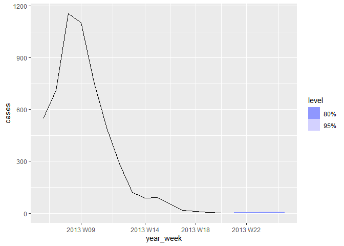
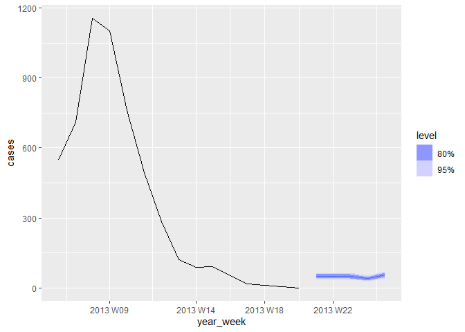

<!-- README.md is generated from README.Rmd. Please edit that file -->

# fableCount <a href="https://gustavo039.github.io/fableCount/"></a>

<!-- badges: start -->
<!-- badges: end -->

The fableCount R package aims to offer counting time series models for
users of the fable framework. These models work within the fable
framework, which provides the tools to evaluate, visualize, and combine
models in a workflow consistent with the tidyverse.

## Installation

You can install the **stable** version from
[CRAN](https://cran.r-project.org/package=fableCount):

``` r
install.packages("fableCount")
```

You can install the **development** version from
[GitHub](https://github.com/Gustavo039/fableCount)

``` r
# requires("devtools")
remotes::install_github("Gustavo039/fableCount")
```

## Count Time Series

A count time series is a sequence of observations that record the number
of events occurring at discrete time intervals. These events can be
anything that can be counted, such as the number of daily sales, the
number of calls received per hour, or the number of cases of a disease
per week.

## INGARCH and GLARMA usage

The package has 2 main functions.

- INGARCH - (Integer Generalized Autoregressive Conditional
  Heteroskedasticity)

- GLARMA - (Generalized Linear Autoregressive Moving Averages)

The usage of the model functions follows the **fable** and
**fabletools** pattern

``` r
dataset |>
  fabletools::model(
    model_name1 = INGARCH(response_variable ~ pq(AR_oder, MA_order)),
    model_name2 = GLARMA(response_variable ~ pq(AR_oder, MA_order))
    )
```

If the *pq()* is ommited, the automatic parameter selection algorithm is
triggered. Such algorithms are based on searching for the model that
presents the lowest AIC or BIC

## Example - Influeza in Germany

The following dataset was taken from the `tscount` package and gives the
weekly number of reported influenza cases in the state of North
Rhine-Westphalia (Germany) from January 2001 to May 2013.

(The cleaned tsibble object can be obtained via
fableCount::influenza_rhine)

``` r
influenza_rhine |>
  autoplot() +
  labs(title = "Influenza Cases in Rhine-Westphalia, Germany",
       y="Number of Cases") +
  theme_minimal()
```



For models estimation, the automatic parameter selection method was used

``` r
model_influenza = influenza_rhine |>
  model(ing = INGARCH(cases),
        gla = GLARMA(cases, method = 'NR'))
```

The estimated models were:

- INGARCH

``` r
model_influenza |> 
  select(ing) |>
  report()
#> Series: cases 
#> Model: INGARCH(2, 0) 
#> 
#> poisson INGARCH(2, 0) w/ identity link
#> # A tibble: 2 × 4
#>   statistic `(Intercept)`  beta_1   beta_2
#>   <chr>             <dbl>   <dbl>    <dbl>
#> 1 Estimate         0.202  0.986   1.04e-10
#> 2 Std.Error        0.0245 0.00864 7.29e- 3
#> 
#> log likelihood=-10521.42
#> AIC=21048.83
#> BIC=21062.24
#> QIC=21049.86
```

- GLARMA

``` r
model_influenza |> 
  select(gla) |>
  report()
#> Series: cases 
#> Model: GLARMA(1, 0) 
#> 
#> Poisson GLARMA(1, 0)
#> # A tibble: 2 × 3
#>   statistic intercept      ar_1
#>   <chr>         <dbl>     <dbl>
#> 1 estimate    3.92    0.0154   
#> 2 std_error   0.00608 0.0000291
#> 
#> log likelihood=-59377
#> AIC=118758
```

With the models already estimated, it is possible to draw a prediction
interval

- INGARCH forecast

``` r
model_influenza |> 
  dplyr::select(ing) |>
  forecast(h = 5) |>
  autoplot(influenza_rhine |>
             dplyr::filter(year_week > tsibble::make_yearweek(2013, 5) )
           )
```



- GLARMA forecast

``` r
model_influenza |> 
  dplyr::select(gla) |>
  forecast(h = 5) |>
  autoplot(influenza_rhine |>
             dplyr::filter(year_week > tsibble::make_yearweek(2013, 5) )
           )
```



## Learning to forecast with fable

- The forecasting principles and practices online textbook provides an
  introduction to time series forecasting using fable:
  <https://otexts.com/fpp3/>
